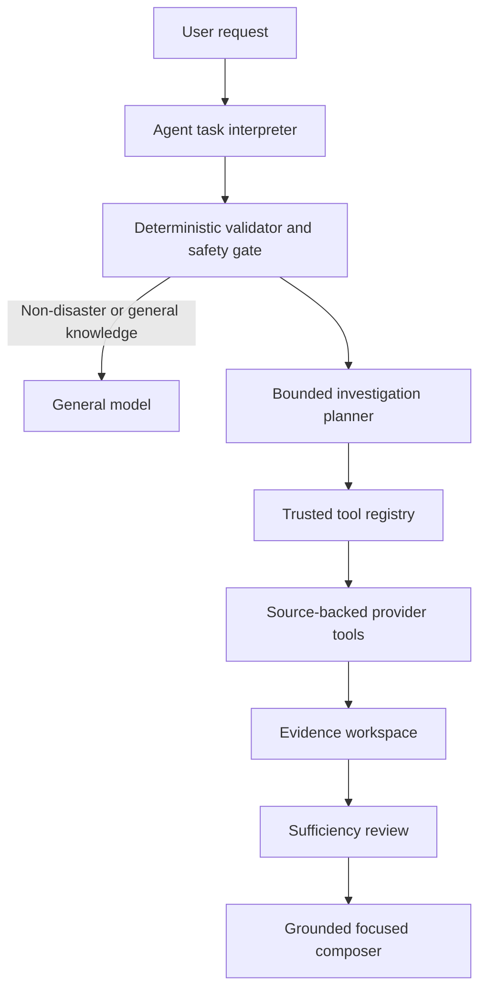

# Agent architecture

Disaster Monitor follows **LLM-first orchestration, evidence-first truth**. The local
agent model may interpret intent and propose a bounded plan. Deterministic validation,
allowlisted tools, provider capabilities, and normalized evidence alone establish
current facts.

Every assistant request enters `RunDisasterAgent`. The agent adapter requests JSON
only, validates exact fields and enums, bounds text and lists, and permits one repair.
It cannot create trusted countries, providers, authorities, URLs, imports, commands,
SQL, or code. Packaged metadata canonicalizes hazards, countries, and calendar dates.
A safety gate retains factual disaster requests even when model interpretation fails.
The deterministic triage lexicon also recognizes bounded English, Spanish,
Vietnamese, and Japanese hazard and information-need phrases. This changes request
routing only; it does not expand declared provider coverage or source authority.

The deterministic fallback plan is available without Ollama:

1. `list_sources_for_task`
2. `find_disaster_event`
3. `retrieve_situation_evidence`
4. `reconcile_disaster_evidence`
5. `compose_disaster_answer`

When admitted multimodal assets are present, the validated plan inserts
`analyze_multimodal_assets` after reconciliation and
`build_common_operational_picture` before composition. These tools consume only
workspace artifacts and never accept model-selected URLs, paths, providers, model IDs,
geometry, or authority. Visual failure records a gap and preserves the text path.

Execution permits at most eight plan steps, twelve tool calls, four bounded model
operations, and one replan decision. There is no recursion, worker, background job,
dynamic import, filesystem discovery, arbitrary URL selection, or generated-code
execution. Tools enforce prerequisites and store normalized artifacts in a
request-scoped evidence workspace. Event discovery stores the auditable physical-event
partition and selected identity as well as its compatibility `DisasterEvent`.
Reconciliation stores the canonical temporal world state, its `EvidencePacket`
projection, and a separate tuple of inferred hypothesis artifacts.
It also derives an internal `IncidentPriorityAssessment` from that same EW version.
The ranker uses verified event severity and current claim observations, retains the
supporting evidence IDs and public rule IDs, and lets ambiguity, conflicts, stale
evidence, or unresolved human-impact gaps raise review priority but never lower it.
`TriageAutonomyPolicy` may autonomously choose only reversible internal monitoring or
queue placement for eligible low/moderate assessments. High or uncertainty-marked
assessments require human-on-the-loop review; critical assessments always use
human-in-the-loop escalation. Incident suppression is not an available action. The
policy's rollback mode routes every otherwise eligible decision to human review.
An explicit decision-support request additionally creates a typed
`DecisionSupportArtifact`. The deterministic generator separates verified facts,
hypothesis-backed estimates, assumptions, contradictions, gaps, and analytical
options. Every option carries complete lineage, trade-offs, uncertainty, and closed
authority constraints. Unsupported facts or an omitted material conflict reject the
artifact; public warnings, evacuation directives, and resource-allocation orders are
always prohibited. Paired human-impact counterfactuals reuse the calibrated EW
hypothesis rather than inventing a second probability. Scenario sensitivity and gaps
are visible in the composed section. The separate recommendation state fails closed on
an unresolved premise and cannot select a high-consequence or human-review option. A
request-scoped autonomy controller can apply the selected eligible option to typed
internal state. Its action, mode, final revision, active internal flags, and termination
reason are exposed without hidden reasoning. Prohibited or unselected action requests,
authority drift, and the rollback switch preserve the initial state and return
advisory-only.
`CurrentDisasterReportService` is a compatibility facade over the same tools.

Canonical EW and decision-support artifacts can be handed to deterministic specialist
roles through `SpecialistHandoffBroker`. Handoffs are request-scoped typed artifacts,
not workers or recursive model calls. The broker derives one owner per task type,
requires state/evidence/source provenance, and grants only permissions already declared
for the receiving role. The sender cannot transfer its own permissions. Invalid
ownership, ambiguous artifact types, missing provenance, unknown fields, and privilege
requests fail closed to the existing single-supervisor path. Investigation metadata
exposes the handoff count and receiving roles.

`CollaborativeInvestigator` runs those deterministic specialists only after their typed
handoffs exist. Evidence, decision, and optional multimodal specialists return stable
finding keys with canonical evidence/source lineage and the closed safety-policy
fingerprint. The coordinator performs a bounded merge; it cannot mutate EW or policy.
Unknown provenance, a changed fingerprint, conflicting values, missing artifacts, or
an iteration overrun discards all specialist findings and retains the pre-existing
single-supervisor result. Status, finding/deadlock counts, iterations, roles, and a safe
fallback reason are inspectable; hidden deliberation is not stored.

`CoordinationSupervisor` owns autonomous analytical termination. It caps one episode at
four handoffs, 24 findings, and two iterations, then compares stable finding keys with a
checklist derived from the artifacts actually present. Only a policy-identical,
provenance-valid, deadlock-free complete checklist terminates as autonomous analytical
coordination. Every other state retains the already-completed bounded default plan. The
supervision ID, status, required/missing keys, evidence IDs, final templated rationale,
and termination reason are user-inspectable; prompts, scratch work, and chain-of-thought
are neither stored nor returned.

Current answers are composed by application code from `EvidencePacket`. Focused
casualty answers include event identity, source, freshness, conflict, and explicit
missing-evidence language; absence is never rendered as zero. The optional API
investigation summary exposes status, normalized task fields, actions, source IDs,
evidence count, gaps, and termination reason. It excludes prompts, raw model/provider
output, chain-of-thought, configuration, stack traces, and secrets.

Historical observations in the workspace are immutable. Claim histories distinguish
current, superseded, materially conflicting, duplicate, unusable/missing, and stale
evidence. Later report omission is retained separately and does not silently retract a
previous value. Hypotheses are always `HypothesisArtifact` values with
`truth_status=inferred`; they are not `ReportedFact` values and are not part of current
verified-fact rendering.

The executable provider registry remains selection authority. A versioned static
source catalog adds semantic roles, jurisdiction, authority, hazard/country scope,
configuration, freshness wording, attribution, limitations, tool links, and provider
names. It also fixes each provider's allowed network hosts. Startup validates all six
executable source IDs, adapter identities, network authorities, and feasible capability
drift.
ReliefWeb remains supplementary, never event verification or an official national
total.

Source-candidate assessment uses a separate application artifact and store. Candidate
metadata can be classified and queued for human review, but it cannot create a provider,
`SourceReference`, catalog descriptor, or trusted authority at runtime.

Exactly one hazard and one catalog country may be investigated. Multiple values
request clarification; unknown countries return a catalog limitation; combinations
without event discovery return coverage unavailable. Image and agent-controlled map
requests without an admitted, associated artifact remain honest capability gaps while
supported text may continue. With a qualifying asset, the agent may produce only the
bounded analytical COP described in
[Multimodal situational awareness](multimodal-awareness.md).

Disaster image retrieval, satellite/aerial monitoring, live raster services, arbitrary
agent-generated layers, CARTO, TerraLabo, online source crawling, and generated
retrieval code remain absent.

EW state also remains request-scoped: there is no database, continuous ingestion,
background revision monitor, cross-request state recovery, or LLM probability model.

The frozen Triage evaluation begins in `tests/evaluation/test_triage.py`. TR-A covers
information-need classification and evidence-path retention with deterministic
multilingual, paraphrase, and adversarial cases. TR-B covers critical-event recall,
false dismissal, ranked relevance, scope parity, uncertainty escalation, lineage, and
repeated-run ordering. TR-C covers eligible autonomy yield, eight-run end-state
reliability, critical escalation, closed action authority, and human-review rollback.

The frozen Decision Support evaluation begins in
`tests/evaluation/test_decision_support.py`. DS-A measures factual support, complete
material trace, option relevance, explicit epistemic separation, contradiction
retention, and repeated deterministic replay. DS-B measures frozen scenario
consistency, calibration, policy adherence, sensitivity/gap exposure, and fail-closed
recommendation behavior. DS-C measures eight-run final-state reliability, correct
state transitions, zero prohibited effects, rollback, and immediate advisory-only
downgrade behavior.

The frozen Coordination evaluation begins in
`tests/evaluation/test_coordination.py`. CO-A measures strict handoff-schema decisions,
complete provenance, task ownership, zero privilege escalation, deterministic replay,
and sender-permission non-inheritance. CO-B measures end-state improvement over the
frozen pre-collaboration baseline, unresolved deadlocks, pass^8, multisource/conflicting/
multimodal packets, and single-supervisor fallback under loop, policy, provenance, and
deadlock attacks. CO-C measures pass^8 on eligible internal episodes, correct
sufficiency/termination under outages and adversarial specialists, zero critical policy
violations, budget fallback, and inspectable final artifacts without hidden reasoning.
