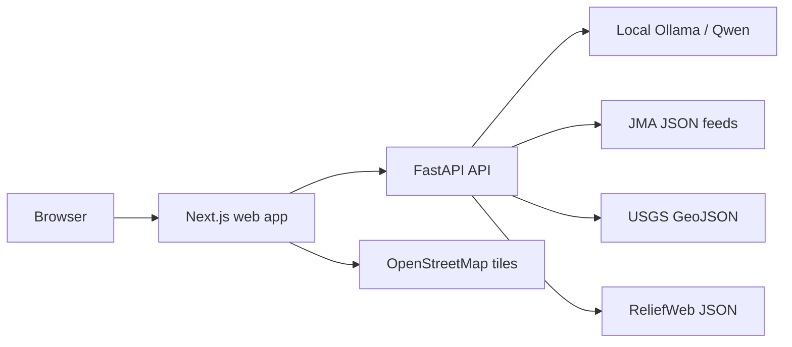
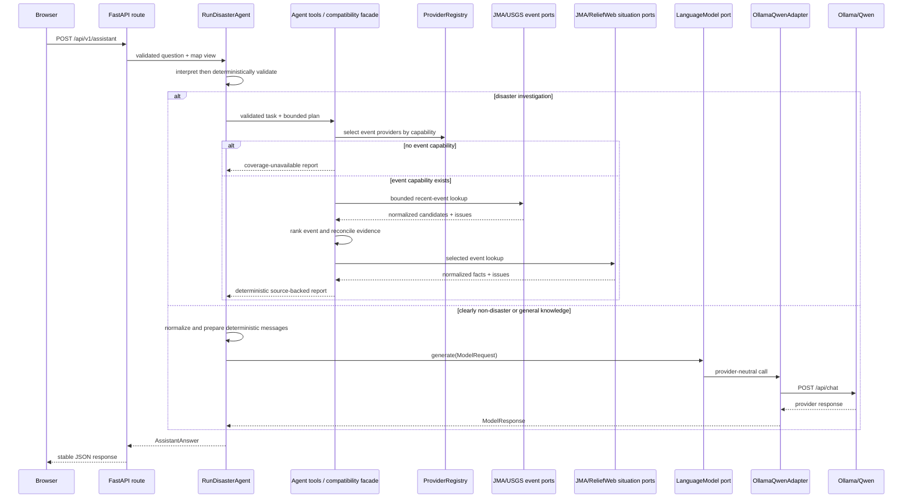
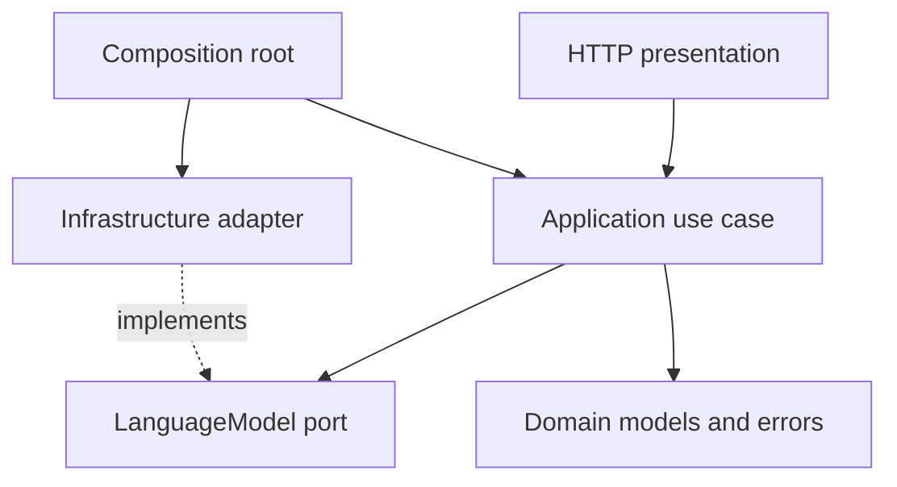

# Architecture

The assistant is agent-first. See [Agent architecture](agent-architecture.md) for
structured interpretation, deterministic validation, bounded tools, the evidence
workspace, safe action logs, and Phase 4 exclusions. The provider architecture below
remains the trusted data plane.

## System context



OpenStreetMap is used only for the basic base map. The current-disaster workflow
normalizes a typed hazard and country before provider access. Japan earthquake
adapters remain the current live scope while capability routing is being expanded;
other live disaster datasets remain unimplemented. The browser retains the conversation for
the current tab session; the API does not persist multi-user conversations.

## Backend request flow



The application layer depends on separate `AgentModel` and `LanguageModel` ports,
disaster-information, source-catalog, and country-catalog ports plus provider-neutral
DTOs. Stable disaster facts live in
`domain/disaster.py`; workflow results and `DisasterQuery` remain in the
application layer. `DisasterQuery` contains one typed `Hazard` and one canonical
`Country`, so country name and ISO code cannot diverge. The application does not
import FastAPI, Ollama, `httpx`, or Pydantic. Composition selects concrete adapters.

## Frontend boundaries

- `AssistantClient` owns HTTP transport and response-shape checks.
- `useAssistantConversation` owns the user-message / assistant-response workflow, status, and errors.
- `SessionConversationStore` owns browser `sessionStorage` serialization.
- `OpenLayersMapAdapter` owns map construction, view conversion, and cleanup.
- `AssistantPanel` and `DisasterMap` render state and emit user actions.
- `app/page.tsx` composes the map, assistant drawer, and current map-view context.

React components do not call Ollama, manipulate browser storage directly, or construct arbitrary OpenLayers layers beyond the adapter boundary.

## Ports and adapters

The application uses these meaningful ports:

```text
LanguageModel
  generate(ModelRequest) -> ModelResponse
  check_readiness() -> ModelReadiness

AgentModel
  interpret(question) -> DisasterTaskDraft
  propose_plan(task, tools) -> InvestigationPlan
  review_progress(task, completed) -> AgentReview

SourceCatalog
  sources() -> tuple[SourceDescriptor, ...]

DisasterEventProvider
  find_recent_events(DisasterQuery, now) -> ProviderBatch[DisasterEvent]

SituationReportProvider
  get_situation_reports(DisasterEvent, DisasterQuery, now) -> ProviderBatch[SituationReport]

CountryCatalog
  find_mentions(text) -> tuple[Country, ...]
  contains(Country, latitude, longitude) -> bool
```

`OllamaQwenAdapter` implements the model port. JMA, USGS, and ReliefWeb adapters
implement the disaster ports. Tests inject deterministic implementations. No
speculative ports exist for weather, satellite, geocoding, or remote providers.

`ProviderRegistry` holds registrations with role, typed hazard, country scope,
configuration requirements, and optional selected-event eligibility. `None` country
scope means global. The fan-out composites invoke only the registry selection and
continue to isolate individual adapter failures. A recognized query with no event
capability returns `current_disaster_coverage_unavailable` before situation lookup
or language-model generation.

Provider fan-out returns raw normalized records. Application-owned event policies
decide physical-event equivalence, clustering, ranking, sequence relationships, and
ambiguity. `EarthquakeEventPolicy` preserves magnitude, intensity, significance,
recency, distance, and aftershock behavior. `DefaultEventPolicy` merges only strong
shared identifiers, prefers newer matching events, and marks similarly recent
independent events ambiguous.

Event identity is represented by `PhysicalEventIdentity`, not only by a merged
`DisasterEvent`. Each identity has a deterministic physical-event ID, the conservative
representative used by the existing report path, every normalized provider observation,
and an assignment record explaining its status and compatible observations. A connected
set is merged only when every observation pair satisfies the hazard policy. A
non-transitive A-B-C match therefore remains separate with typed ambiguous assignments;
input/provider ordering cannot choose a different partition. Hazard and ISO country
scope are unconditional identity boundaries for every policy.

`CurrentDisasterReportService` orchestrates only the workflow. `EvidenceReconciler`
first constructs an immutable `EvidenceWorldState`. It retains accepted reports and
every fact observation, then classifies each claim history as current, superseded,
conflicting, duplicate, or unusable plus fresh or stale. Effective chronology is
centralized as source update, publication, fact observation, then retrieval time.
Selection uses typed authority, effective chronology, fact status, and a stable
tie-break. A later same-source omission is recorded but does not erase or convert the
prior observation to zero. The legacy `EvidencePacket` fields are a deterministic
projection of this state, so `DisasterReportRenderer` and focused answers have no
second reconciliation decision. `report_profiles.py` supplies earthquake-specific or
generic section configuration.

`HypothesisGenerator` consumes only `EvidenceWorldState` and writes separate
`HypothesisArtifact` values to `EvidenceWorkspace`. A hypothesis has an `inferred`
truth type, deterministic key, probability, evidence references, state version,
evaluation time, and public rule features. It cannot enter `EvidencePacket.facts`, and
the current API/report renderer does not display hypotheses as verified facts.

## Dependency direction



Transport schemas and Ollama payloads remain at the edges. The use case prepares a deterministic system prompt that prevents claims about unavailable live data and strips common hidden-reasoning wrappers from model output.

AST dependency tests enforce that domain modules import only the standard library,
application modules do not import infrastructure, presentation, FastAPI, HTTP/PDF
clients, Pydantic, or Ollama, and concrete adapters are constructed only in composition
or bootstrap modules.

The Evidence / World-State release evaluations live under
`tests/evaluation/fixtures/evidence_world_state/` and run with:

```powershell
uv run --directory apps/api pytest -q tests/evaluation/test_evidence_world_state.py
```

The canonical state remains request-scoped. This implementation does not claim a
persistent event store, continuous monitoring, multimodal evidence, learned causal
forecasting, or autonomous user-visible hypotheses.

## Composition and testing

`create_app` accepts optional adapters for tests. Production construction builds
`Settings`, the packaged `StaticCountryCatalog`, `DisasterQueryParser`, source
providers, `OllamaQwenAdapter`, and `AnswerMapQuestion`. Backend tests use a fake
model and `httpx.ASGITransport`; adapter tests use `httpx.MockTransport`.

The versioned MVP country resource currently recognizes Japan, Vietnam, and
Venezuela by canonical English name, ISO alpha-2/alpha-3 code, and declared exact
aliases. Its query rectangles and simplified polygons are Natural Earth-derived
geographic approximations, not legal borders or maritime claims. Fixed calendar
offsets are used for these three countries,
which do not use seasonal daylight-saving transitions.

## Adding a future external-data capability

1. Define the smallest application DTO and port needed by a user-facing use case.
2. Validate and normalize its input in the application layer.
3. Implement the provider-specific HTTP or SDK behavior in `infrastructure`.
4. Construct the adapter explicitly in the composition root.
5. Add deterministic unit and adapter tests before wiring a UI control.
6. Keep unavailable or unconfigured data visibly unavailable; do not return placeholder success.

If the capability needs map overlays, add a focused map operation to the existing adapter only after the application feature uses it. Do not turn `OpenLayersMapAdapter` into a generic mapping framework.
