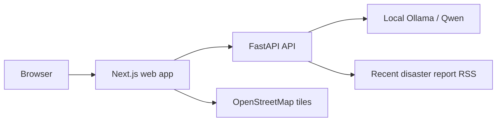
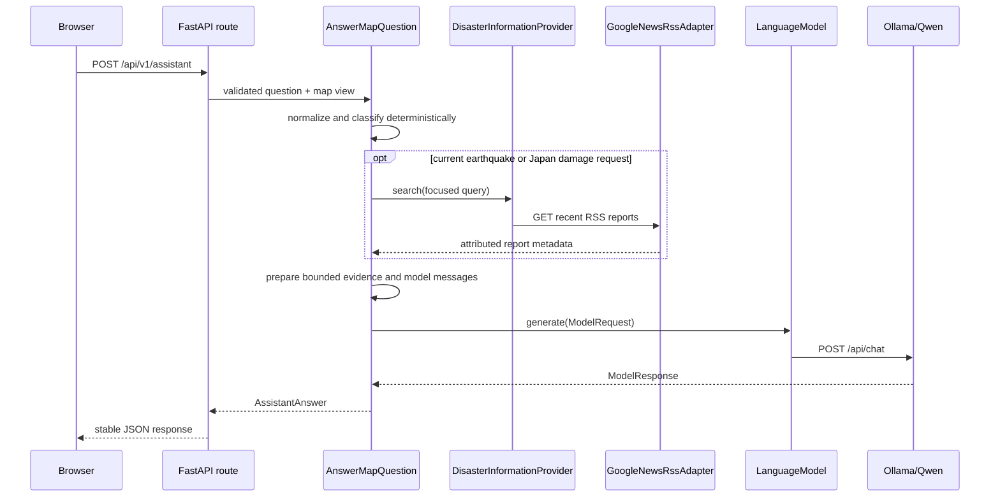
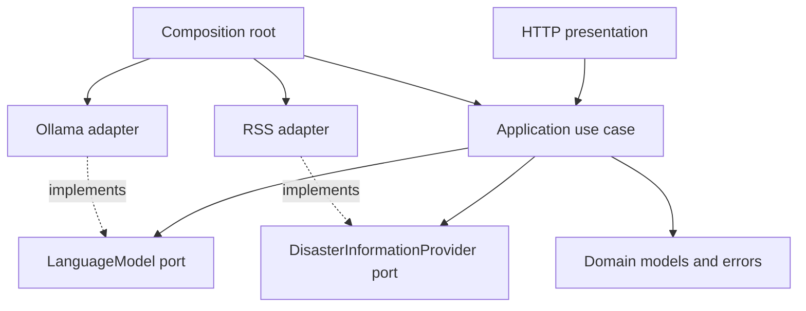

# Architecture

## System context



OpenStreetMap is used only for the base map. The RSS connection is narrowly scoped to recent report discovery for explicit latest/current earthquake requests and latest damage requests about Japan. The browser retains the conversation for the current tab session; the API does not persist multi-user conversations.

## Backend request flow



The application layer depends on provider-neutral protocols and DTOs. It does not import FastAPI, Ollama, RSS/XML parsing, `httpx`, or Pydantic. `main.create_app` is the composition root that selects and closes the concrete adapters.

## Ports and adapters

```text
LanguageModel
  generate(ModelRequest) -> ModelResponse
  check_readiness() -> ModelReadiness

DisasterInformationProvider
  search(query) -> DisasterInformationResult
```

`OllamaQwenAdapter` implements the model port. `GoogleNewsRssDisasterInformationAdapter` implements the current-information port. Tests inject fake implementations. No speculative ports exist for weather, satellite, geocoding, or flood providers.

## Current-information safety boundary

Routing is deterministic rather than delegated to the model. The supported trigger requires an explicit recency marker and either an earthquake marker or a Japan-plus-damage combination. Provider results are serialized into a bounded evidence block with retrieval time, title, source, publication time, URL, and summary.

The system prompt treats source text as untrusted data, forbids current answers from model memory, requires language matching and attribution, preserves preliminary or conflicting reports, and instructs the model to say that the latest damage cannot be verified when lookup is empty or unavailable. Provider failure degrades the answer context instead of failing the entire assistant endpoint.

## Dependency direction



Transport schemas, Ollama payloads, HTTP calls, and XML parsing remain at the edges.

## Composition and testing

`create_app(settings, model, disaster_information_provider)` accepts optional adapters for tests. Production construction builds `Settings`, `OllamaQwenAdapter`, `GoogleNewsRssDisasterInformationAdapter`, then `AnswerMapQuestion`. Backend tests use fake ports and `httpx.ASGITransport`; adapter tests use `httpx.MockTransport`. Default tests do not need Ollama or network access.

## Adding another external-data capability

1. Define the smallest application DTO and port required by a concrete user request.
2. Add deterministic routing and normalization in the application layer.
3. Implement provider-specific HTTP or SDK behavior in `infrastructure`.
4. Bound and label provider evidence before it reaches the model.
5. Construct and close the adapter explicitly in the composition root.
6. Add unit, adapter, and HTTP tests before wiring UI controls.
7. Keep unavailable data visibly unavailable; never return placeholder success.
