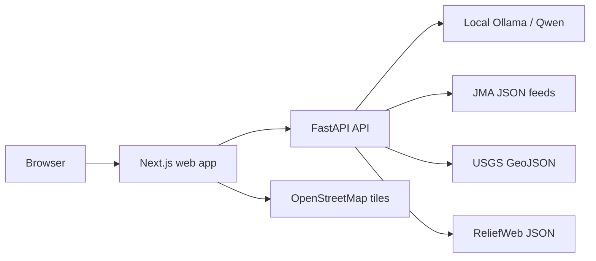
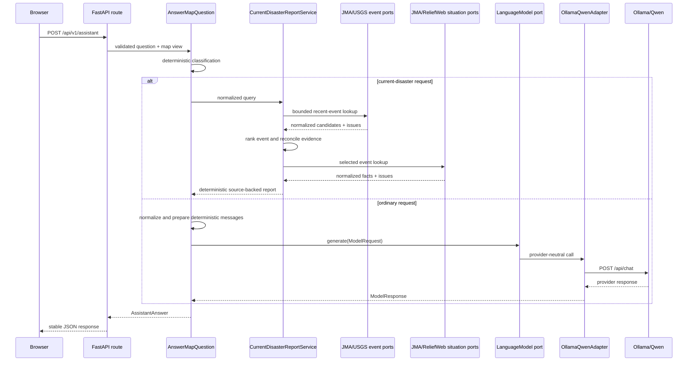
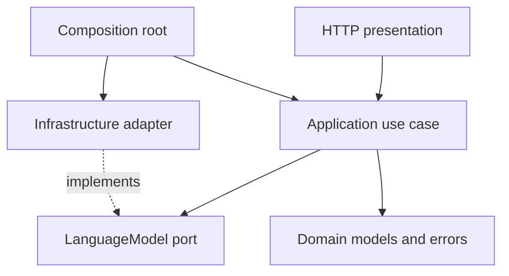

# Architecture

## System context



OpenStreetMap is used only for the basic base map. The current-earthquake
workflow has bounded JMA, USGS, and ReliefWeb source adapters; other live
disaster datasets remain unimplemented. The browser retains the conversation for
the current tab session; the API does not persist multi-user conversations.

## Backend request flow



The application layer depends on the `LanguageModel` protocol and provider-neutral DTOs. It does not import FastAPI, Ollama, `httpx`, or Pydantic. `main.create_app` is the composition root that selects the concrete adapter.

## Frontend boundaries

- `AssistantClient` owns HTTP transport and response-shape checks.
- `useAssistantConversation` owns the user-message / assistant-response workflow, status, and errors.
- `SessionConversationStore` owns browser `sessionStorage` serialization.
- `OpenLayersMapAdapter` owns map construction, view conversion, and cleanup.
- `AssistantPanel` and `DisasterMap` render state and emit user actions.
- `app/page.tsx` composes the map, assistant drawer, and current map-view context.

React components do not call Ollama, manipulate browser storage directly, or construct arbitrary OpenLayers layers beyond the adapter boundary.

## Ports and adapters

The application uses these meaningful ports:

```text
LanguageModel
  generate(ModelRequest) -> ModelResponse
  check_readiness() -> ModelReadiness

DisasterEventProvider
  find_recent_events(DisasterQuery, now) -> ProviderBatch[DisasterEvent]

SituationReportProvider
  get_situation_reports(DisasterEvent, DisasterQuery, now) -> ProviderBatch[SituationReport]
```

`OllamaQwenAdapter` implements the model port. JMA, USGS, and ReliefWeb adapters
implement the disaster ports. Tests inject deterministic implementations. No
speculative ports exist for weather, satellite, geocoding, or remote providers.

## Dependency direction



Transport schemas and Ollama payloads remain at the edges. The use case prepares a deterministic system prompt that prevents claims about unavailable live data and strips common hidden-reasoning wrappers from model output.

## Composition and testing

`create_app(settings, model)` accepts an optional model for tests. Production construction builds `Settings`, then `OllamaQwenAdapter`, then `AnswerMapQuestion`. Backend tests use a fake model and `httpx.ASGITransport`; adapter tests use `httpx.MockTransport`. Frontend tests cover the client, session store, assistant states, and form submission. The Playwright system test starts the real Next.js UI against a FastAPI app with a fake model.

## Adding a future external-data capability

1. Define the smallest application DTO and port needed by a user-facing use case.
2. Validate and normalize its input in the application layer.
3. Implement the provider-specific HTTP or SDK behavior in `infrastructure`.
4. Construct the adapter explicitly in the composition root.
5. Add deterministic unit and adapter tests before wiring a UI control.
6. Keep unavailable or unconfigured data visibly unavailable; do not return placeholder success.

If the capability needs map overlays, add a focused map operation to the existing adapter only after the application feature uses it. Do not turn `OpenLayersMapAdapter` into a generic mapping framework.
